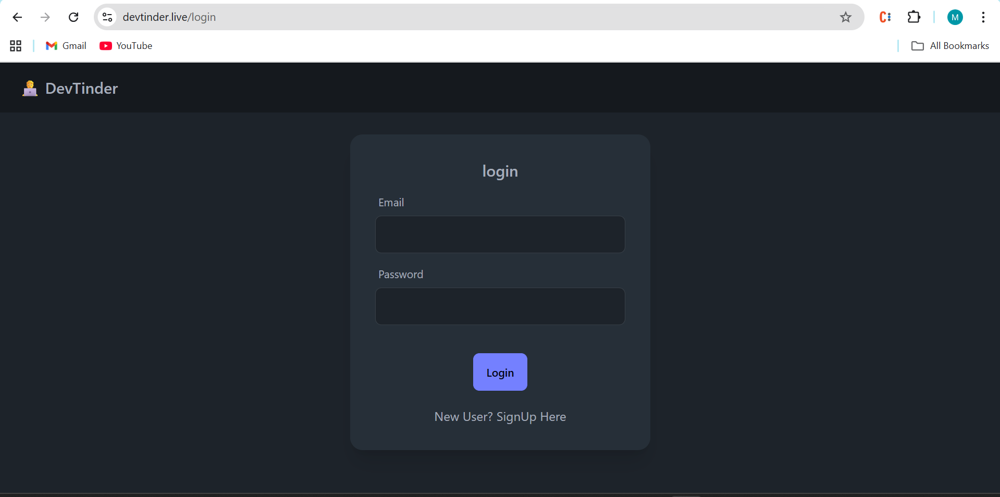
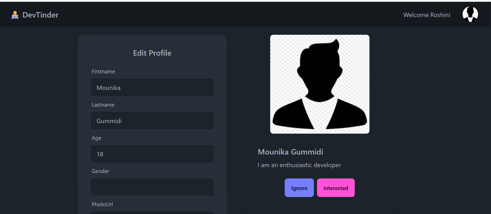
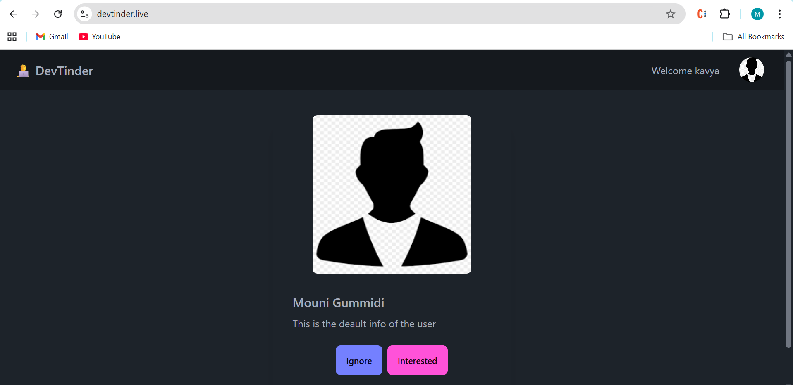

# DevTinder

DevTinder is a platform designed for developers to connect, collaborate, and build meaningful professional relationships. It allows users to create profiles, send connection requests, and manage their connections seamlessly.

## Features

### Backend (Node.js, Express, MongoDB)
- **Authentication**: Signup, login, and logout functionality with secure password hashing and JWT-based authentication.
- **Profile Management**: View and edit user profiles, including fields like name, age, gender, skills, and more.
- **Connection Requests**: Send and review connection requests with statuses like "interested", "ignored", "accepted", and "rejected".
- **Feed**: Display a list of other users on the platform for potential connections.
- **Database**: MongoDB is used to store user data and connection requests.

### Frontend (React, Redux, TailwindCSS)
- **User Interface**: A responsive and modern UI built with React and styled using TailwindCSS and DaisyUI.
- **State Management**: Redux Toolkit is used for managing global state (e.g., user data, feed, requests, and connections).
- **Routing**: React Router is used for navigation between pages like login, profile, feed, connections, and requests.
- **API Integration**: Axios is used to communicate with the backend APIs.

## Installation

### Backend
1. Navigate to the `dev-tinder-be` directory:
   ```sh
   cd dev-tinder-be
   ```
2. Install dependencies:
   ```sh
   npm install
   ```
3. Start the server:
   ```sh
   npm run dev
   ```

### Frontend
1. Navigate to the `dev-tinder-web` directory:
   ```sh
   cd dev-tinder-web
   ```
2. Install dependencies:
   ```sh
   npm install
   ```
3. Start the development server:
   ```sh
   npm run dev
   ```

## Tech Stack

- **Backend**: Node.js, Express, MongoDB, Mongoose
- **Frontend**: React, Redux Toolkit, TailwindCSS, DaisyUI
- **Authentication**: JWT, bcrypt
- **API Communication**: Axios

## Usage

1. **Signup/Login**: Create an account or log in to access the platform.
2. **Edit Profile**: Update your profile details like name, age, skills, etc.
3. **Feed**: Browse other users and send connection requests.
4. **Requests**: Review and accept/reject incoming connection requests.
5. **Connections**: View your accepted connections.

## Screenshots

### Login Page


### Profile Page


### Feed Page



